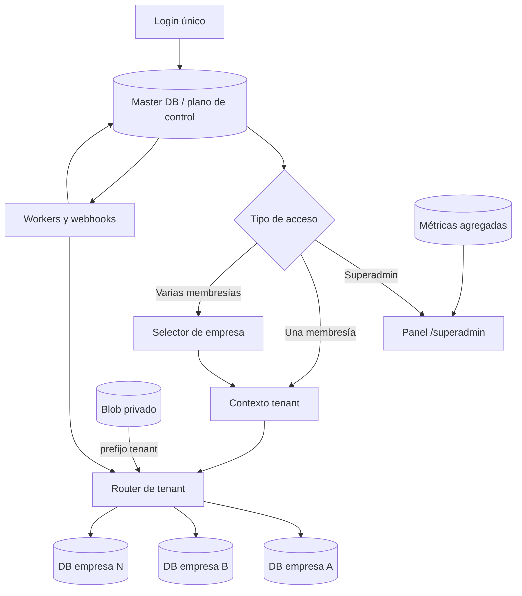

# Plan maestro multiusuario, multitenant y panel Superadmin

## 1. Objetivo

Convertir Anchi en una única plataforma compartida por múltiples empresas y múltiples usuarios, garantizando que:

- cada empresa tenga sus propios usuarios, configuración, canales, mensajes, pedidos, clientes, productos, archivos, integraciones y trazabilidad;
- ningún usuario pueda leer, modificar o inferir datos de otra empresa;
- un usuario pueda pertenecer a una o varias empresas sin que el sistema elija una empresa de forma ambigua;
- exista un panel independiente de **Superadmin de plataforma** para crear y gestionar empresas y usuarios, revisar estadísticas, salud, consumo e incidencias;
- un Administrador de empresa no sea nunca equivalente a un Superadmin de plataforma;
- las altas, bajas, invitaciones, suspensiones y cambios de rol sean auditables y revocables;
- los workers, webhooks, cron, almacenamiento y cachés respeten el mismo aislamiento que las rutas web.

Este documento es un plan de implementación. No ejecuta migraciones ni modifica datos de producción.

## 2. Resumen ejecutivo

Anchi ya contiene una base útil para construir el producto multiempresa:

- una Master DB con `MasterCompany`, `MasterUser`, `CompanyMembership` y `MasterTenantDatabase`;
- resolución de tenant basada en una membresía coherente;
- una DB operativa por empresa;
- `company_id` en todas las entidades operativas relevantes;
- workers que recorren el registro de tenants;
- tests básicos de aislamiento entre dos empresas.

Sin embargo, el sistema todavía **no es multiusuario funcional de extremo a extremo**. El principal problema es que existen dos identidades distintas:

1. `MasterUser`, que sí autentica el login.
2. `app.db.models.User`, que vive en la DB tenant y es la tabla que modifica la pantalla `/users`.

Crear un usuario desde la interfaz actual no crea necesariamente su identidad en Master DB, su membresía ni una sesión válida. Además, los permisos declarados en `core/permissions.py` no llegan al usuario autenticado: `TenantRole.permissions` se construye como cadena vacía y la mayoría de rutas solo verifican autenticación, no autorización por capacidad.

La recomendación es consolidar la identidad en Master DB, mantener en cada tenant únicamente una proyección de actor para claves foráneas y auditoría, e introducir dos planos separados:

- **Plano de control**: identidad global, empresas, membresías, Superadmin, provisioning, estado y métricas agregadas.
- **Plano de datos**: información operativa privada de cada empresa.

La primera entrega debe conservar **una DB operativa por empresa**. Compartir una misma DB entre tenants no debe habilitarse hasta eliminar accesos no acotados como `db.get(Model, id)`, añadir restricciones compuestas y completar pruebas de aislamiento para todas las entidades.

## 3. Diagnóstico del estado actual

### 3.1 Capacidades que ya existen y deben conservarse

| Área | Estado actual | Decisión |
|---|---|---|
| Registro maestro | `MasterCompany`, `MasterUser`, `CompanyMembership` y `MasterTenantDatabase` ya existen | Evolucionar estas tablas; no crear un segundo sistema paralelo |
| Resolución tenant | La sesión exige que `membership_id`, `user_id` y `company_id` coincidan | Mantener esta comprobación como invariante |
| Separación física | `get_tenant_db` abre la DB registrada para la empresa activa | Mantener DB por empresa en la primera versión |
| Modelos operativos | Las entidades tenant relevantes contienen `company_id` | Conservarlo como defensa adicional aunque la DB sea dedicada |
| Usuarios multiempresa | Master DB ya permite varias membresías para un mismo email | Añadir selector explícito de empresa; eliminar la selección implícita |
| Workers | Email y jobs recorren `MasterTenantDatabase` activos | Formalizar contexto tenant, límites, locks e idempotencia |
| Observabilidad | Logs de request incluyen tenant, usuario, membresía y correlación | Extender a acciones de plataforma y cambios de identidad |
| Tests | Existe cobertura de sesión manipulada, empresa inactiva e IDs iguales en DB distintas | Ampliarla a todos los recursos y permisos |

### 3.2 Bloqueadores para considerarlo multiusuario

#### P0. Dos fuentes de verdad para usuarios

- El login consulta `app.master.models.MasterUser` y `CompanyMembership`.
- `/users` crea y edita `app.db.models.User` dentro de la DB tenant.
- El script `scripts/provision_company.py` intenta mantener ambas tablas, pero no existe una operación transaccional común para el uso diario.
- Los IDs de `MasterUser` se reutilizan como si fueran IDs de `User` tenant. Si no coinciden, la auditoría puede quedar sin actor o atribuir la acción a otro registro local con el mismo ID.
- Los campos `updated_by`, `deleted_by`, `created_by_user_id`, `approved_by` y `AuditLog.user_id` apuntan a la tabla tenant `users`, mientras el usuario de la sesión procede de Master DB.

**Consecuencia:** la creación, desactivación, cambio de contraseña y atribución de acciones no tienen una fuente de verdad consistente.

#### P0. Autorización incompleta

- Existe un catálogo `PERMISSIONS`, pero el usuario autenticado recibe `permissions=""`.
- Solo unas pocas rutas usan `require_tenant_role`; gran parte de las 151 rutas mutadoras se apoya únicamente en `current_user`.
- Algunas capacidades se deciden comparando etiquetas como `"Administrador"`, `"Supervisor"` o `"Superadmin"` directamente en cada módulo.
- Ocultar un enlace en Jinja no impide llamar al endpoint.
- `/users` no exige actualmente `manage_users` ni un rol administrador.

**Consecuencia:** un usuario autenticado con un rol limitado puede alcanzar operaciones que la interfaz no le muestra.

#### P0. Superadmin ligado a una empresa

- `require_master_admin` identifica al Superadmin mediante `CompanyMembership.role_key == "Superadmin"`.
- Por tanto, el privilegio global está mezclado con un rol de empresa y necesita una membresía tenant para autenticarse.
- La pantalla existente `/admin/diagnostics` es una vista técnica, no un panel de administración de plataforma.

**Consecuencia:** no existe una frontera limpia entre operar una empresa y administrar toda la plataforma.

#### P0. Ausencia de ciclo de vida de cuentas

No se han encontrado flujos completos para:

- invitación con token de un solo uso;
- activación y verificación de email;
- restablecimiento de contraseña;
- revocación de sesiones;
- expiración por cambio de contraseña;
- bloqueo temporal o rate limiting del login;
- transferencia segura de propietario;
- prohibición de eliminar al último propietario activo.

#### P0. Mutaciones web sin protección CSRF explícita

La aplicación usa cookie de sesión y formularios `POST`, pero no se ha encontrado un token CSRF ni una validación central de `Origin`/`Referer`. `SameSite=Lax` ayuda, pero no sustituye una protección CSRF para todas las mutaciones.

#### P1. Selección de empresa ambigua

Cuando un usuario pertenece a varias empresas, `authenticate_master_user` ordena las membresías y selecciona una automáticamente usando dominio del email, existencia de DB, estado e indicador de owner.

**Consecuencia:** el usuario no sabe qué empresa se ha activado y no dispone de un cambio de empresa explícito.

#### P1. Credenciales de DB tenant en texto reversible directo

`MasterTenantDatabase.database_url` guarda una URL completa. No se ha encontrado un uso real de `tenant_db_encryption_key` para cifrar ese campo.

**Consecuencia:** una lectura de Master DB puede exponer credenciales de todas las bases operativas.

#### P1. Migraciones ejecutadas durante peticiones

`load_tenant_context` llama a `ensure_tenant_schema_once`. Aunque existe caché de proceso, una instancia fría puede ejecutar comprobaciones o migraciones al iniciar sesión o cargar una página.

**Consecuencia:** latencia impredecible, riesgo de bloqueo de esquema y comportamiento distinto entre instancias serverless.

#### P1. Estadísticas Superadmin con fan-out síncrono

`company_diagnostics_overview` abre y consulta cada DB tenant para dibujar una única pantalla. El coste crece linealmente con el número de empresas y una DB lenta puede penalizar toda la vista.

#### P1. Enrutado WhatsApp no escalable

El webhook global recorre todas las DB tenant para localizar `phone_number_id` y `business_account_id`.

**Consecuencia:** cada evento WhatsApp escala con el número de empresas. Debe resolverse con un índice en Master DB.

#### P1. Almacenamiento temporal sin namespace tenant obligatorio

- Los adjuntos usan `attachments/{uuid}-{filename}` sin exigir `company_id` en la API de almacenamiento.
- Las previsualizaciones de importación se guardan en un directorio común y se recuperan solo por token.
- Algunas rutas mock escriben archivos con nombres derivados del pedido.

**Consecuencia:** aunque los tokens aleatorios reducen el riesgo, la pertenencia al tenant no está expresada ni validada por la capa de almacenamiento.

#### P1. Auditoría dividida

- `AuditLog` vive en la DB tenant.
- No hay un audit log maestro para altas, suspensiones, roles globales, provisioning o acceso de soporte.
- `log_action` intenta resolver el ID maestro dentro de la tabla local `User`, lo que puede perder o confundir la atribución.

### 3.3 Conclusión del diagnóstico

No hace falta rehacer la aplicación. Sí hace falta completar y endurecer la frontera que ya se empezó a construir. El orden correcto es identidad y autorización primero; paneles y estadísticas después. Construir primero la interfaz Superadmin encima del modelo actual consolidaría errores difíciles de migrar.

## 4. Invariantes de arquitectura

Estas reglas deben convertirse en documentación, helpers compartidos y tests obligatorios:

1. La identidad humana se autentica exclusivamente en Master DB.
2. El privilegio de plataforma nunca se deriva de una membresía de empresa.
3. Toda petición tenant tiene un `master_user_id`, `membership_id`, `company_id` y `tenant_actor_id` coherentes.
4. El cliente nunca elige libremente `company_id`; solo selecciona una membresía propia y activa.
5. Cada operación tenant abre únicamente el destino registrado para esa membresía.
6. En la primera versión, una DB operativa pertenece a una sola empresa.
7. Todas las lecturas y escrituras por ID verifican empresa incluso dentro de una DB dedicada.
8. Todo endpoint mutador exige permiso de backend y protección CSRF.
9. Todo trabajo asíncrono transporta `company_id` y valida el tenant antes de ejecutarse.
10. Toda clave de caché, archivo temporal, adjunto y exportación incorpora el tenant.
11. Ningún log contiene contraseñas, tokens, URLs de DB completas ni cuerpos sensibles.
12. Desactivar un usuario, membresía o empresa invalida el acceso como máximo en la siguiente petición.
13. Cambiar contraseña o revocar acceso invalida todas las sesiones afectadas.
14. Ninguna vista Superadmin consulta en línea todas las DB tenant.
15. Provisioning y migraciones son idempotentes, reanudables y no se ejecutan dentro de una navegación normal.

## 5. Arquitectura objetivo



### 5.1 Plano de control: Master DB

Debe ser la fuente de verdad para:

- identidades y credenciales;
- rol de plataforma;
- empresas y su ciclo de vida;
- membresías y roles tenant;
- invitaciones y restablecimientos de contraseña;
- sesiones y revocación;
- registro cifrado/referenciado de DB tenant;
- endpoints externos necesarios para enrutar webhooks;
- estado de provisioning y migraciones;
- métricas agregadas y salud;
- auditoría de Superadmin.

### 5.2 Plano de datos: DB tenant

Debe conservar:

- compañía operativa y branding;
- actor local proyectado;
- clientes, contactos y productos;
- email, WhatsApp, conversaciones y adjuntos;
- pedidos, líneas, revisiones y exportaciones;
- configuraciones de IA, scoring, canales, FTP, proxy y BBDD externas;
- jobs, logs funcionales y aprendizaje;
- auditoría de acciones dentro de la empresa.

### 5.3 Estrategia de aislamiento

#### Entrega inicial recomendada

- Una DB Postgres dedicada por empresa en producción.
- `MasterTenantDatabase` resuelve la conexión.
- Una única empresa válida dentro de cada DB tenant.
- `company_id` sigue presente en consultas y restricciones.

#### Evolución futura, no habilitada inicialmente

Solo permitir shards compartidos cuando se cumpla todo lo siguiente:

- no queden lecturas directas por ID sin `company_id`;
- existan claves únicas y relaciones compuestas con `company_id`;
- PostgreSQL RLS esté activo y probado;
- el pool establezca un contexto tenant seguro por transacción;
- haya tests hostiles contra todos los recursos;
- la revisión de seguridad apruebe la mezcla física.

## 6. Modelo de identidad y datos propuesto

### 6.1 Cambios en Master DB

#### `users` (evolución de `MasterUser`)

Añadir:

- `platform_role_key`: `superadmin` o `null`; no usar el rol de membresía.
- `email_normalized`: único, en minúsculas y normalizado.
- `email_verified_at`.
- `password_changed_at`.
- `session_version`: entero para revocar sesiones.
- `failed_login_count`, `locked_until`, `last_login_at`.
- `created_by_master_user_id`, `deactivated_at`, `deactivated_by_master_user_id`.

No guardar preferencias tenant en esta tabla.

#### `companies`

Añadir:

- `status`: `provisioning`, `active`, `suspended`, `failed`, `deactivated`.
- `plan_key` y límites básicos.
- `owner_membership_id` o una regla equivalente verificable.
- `provisioning_state`, `provisioning_error_code` y timestamps.
- `suspended_at`, `deactivated_at` y motivo.
- metadatos de región y residencia de datos si se necesitan.

#### `memberships`

Estandarizar:

- `role_key`: claves estables en inglés interno, no etiquetas traducidas.
- roles iniciales: `owner`, `admin`, `supervisor`, `operator`, `read_only`.
- `status`: `invited`, `active`, `suspended`, `removed`.
- `invited_by`, `joined_at`, `removed_at`.
- `permissions_version` para invalidar caché si cambia el rol.

Eliminar `Superadmin` del conjunto de roles tenant. `is_owner` puede mantenerse durante la migración, pero la fuente final debe ser `role_key=owner` o una restricción explícita única.

#### Nuevas tablas maestras

| Tabla | Finalidad |
|---|---|
| `user_invitations` | Alta segura con token hasheado, empresa, rol, expiración y estado |
| `password_reset_tokens` | Recuperación de contraseña con token hasheado y un solo uso |
| `user_sessions` | Revocación, expiración, versión, última actividad y metadatos mínimos |
| `platform_audit_logs` | Acciones de Superadmin y operaciones de identidad/provisioning |
| `tenant_provisioning_runs` | Saga idempotente y reanudable de alta de empresa |
| `tenant_usage_daily` | Estadísticas agregadas por empresa y día |
| `tenant_health_snapshots` | Salud de DB, canales, workers y esquema sin fan-out de la UI |
| `whatsapp_endpoints` | Índice único `phone_number_id -> company_id + tenant_database_id` |

### 6.2 Proyección de actor en DB tenant

No conviene borrar inmediatamente `app.db.models.User` porque muchas claves foráneas dependen de ella. Debe transformarse gradualmente en una proyección local:

- añadir `master_user_id` obligatorio para usuarios humanos;
- restricción única `(company_id, master_user_id)`;
- mantener `id` local como `tenant_actor_id` para FKs existentes;
- dejar de autenticar o cambiar contraseñas desde esta tabla;
- hacer `password_hash` nullable/deprecado y eliminarlo en una fase posterior;
- sincronizar nombre y estado mediante un servicio idempotente;
- diferenciar actores del sistema con `actor_type=human|system|integration`.

El objeto de sesión debe exponer ambos identificadores de forma inequívoca:

```text
AuthenticatedPrincipal
  master_user_id
  membership_id
  company_id
  tenant_actor_id
  platform_role_key
  tenant_role_key
  permissions
```

Nunca volver a llamar simplemente `user.id` a dos IDs de tablas diferentes.

### 6.3 Roles y permisos

Usar permisos de capacidad, no etiquetas de rol, como contrato del backend.

| Rol tenant | Capacidades orientativas |
|---|---|
| `owner` | Todas las capacidades tenant, propiedad y transferencia |
| `admin` | Usuarios, configuración, canales, datos maestros y operaciones |
| `supervisor` | Revisar/confirmar/exportar, consultar logs funcionales y probar canales |
| `operator` | Bandejas, pedidos y acciones operativas asignadas |
| `read_only` | Lectura sin mutaciones |

Permisos mínimos a formalizar:

- `orders.view`, `orders.review`, `orders.confirm`, `orders.export`, `orders.archive`;
- `mail.view`, `mail.process`, `mail.reply`, `mail.bulk_manage`;
- `whatsapp.view`, `whatsapp.reply`, `whatsapp.manage_channel`;
- `customers.view`, `customers.edit`, `customers.import`, `customers.delete`;
- `products.view`, `products.edit`, `products.import`, `products.delete`;
- `settings.view`, `settings.branding`, `settings.channels`, `settings.ai`, `settings.exports`;
- `integrations.proxy`, `integrations.ftp`, `integrations.database`;
- `learning.review`, `logs.view`, `logs.delete`, `users.manage`, `ownership.transfer`.

Crear dependencias centrales:

```text
require_tenant_permission("orders.confirm")
require_platform_permission("companies.manage")
```

Los templates consumirán los mismos permisos para presentación, pero la decisión autoritativa seguirá en backend.

## 7. Flujos funcionales objetivo

### 7.1 Login

1. Normalizar email.
2. Aplicar rate limit por cuenta e IP sin revelar si el email existe.
3. Verificar `MasterUser` activo y contraseña.
4. Si tiene rol de plataforma, ofrecer entrada al panel Superadmin.
5. Cargar solo membresías activas de empresas activas.
6. Si hay una, activarla.
7. Si hay varias, mostrar selector de empresa.
8. Crear sesión server-side y cookie opaca `HttpOnly`, `Secure`, `SameSite=Lax`.
9. Proyectar/resolver `tenant_actor_id` al entrar en una empresa.
10. Registrar login, empresa elegida y resultado sin guardar credenciales.

Eliminar la heurística actual que selecciona empresa por el dominio del email.

### 7.2 Cambio de empresa

- Endpoint `POST /account/switch-company` con CSRF.
- Solo acepta `membership_id` del usuario autenticado.
- Revalida usuario, membresía, empresa y DB.
- Rota el ID de sesión para evitar fijación.
- Limpia estado tenant de sesión, cachés y preferencias sensibles.
- Redirige a la entrada predeterminada de la nueva empresa.

### 7.3 Invitación de usuario por Administrador de empresa

1. Comprobar `users.manage`.
2. Normalizar el email y buscar/reutilizar `MasterUser` sin revelar otras membresías.
3. Crear membresía `invited` y actor tenant pendiente mediante una saga idempotente.
4. Generar token aleatorio; guardar solo su hash y expiración.
5. Enviar enlace de invitación.
6. Al aceptar: verificar email, establecer contraseña si procede, activar membresía y actor.
7. Revocar el token y registrar auditoría maestra y tenant.

Si el usuario ya tiene cuenta, la invitación solo añade la nueva membresía; no cambia su contraseña.

### 7.4 Gestión de usuarios de empresa

La nueva pantalla tenant debe permitir:

- listar miembros e invitaciones;
- invitar y reenviar invitación;
- cancelar invitación;
- cambiar rol;
- suspender/reactivar acceso;
- revocar sesiones de esa membresía;
- transferir propiedad;
- ver última actividad y estado, sin exponer actividad de otras empresas.

Reglas obligatorias:

- un admin no puede conceder privilegios de plataforma;
- nadie puede eliminar al último owner activo;
- un admin no owner no puede degradar o eliminar al owner;
- las operaciones críticas requieren reautenticación o confirmación reforzada;
- desactivar una membresía no desactiva la identidad si pertenece a otras empresas.

### 7.5 Alta de empresa desde Superadmin

Debe ser una operación asíncrona e idempotente:

1. Crear `MasterCompany(status=provisioning)`.
2. Reservar slug único.
3. Crear `tenant_provisioning_run` con clave idempotente.
4. Provisionar o asociar la DB tenant.
5. Ejecutar migraciones fuera de la petición web.
6. Crear la fila `Company` tenant.
7. Sembrar configuración base, roles y canales desactivados.
8. Crear o reutilizar identidad del owner.
9. Crear membresía y actor tenant.
10. Enviar invitación, no mostrar una contraseña permanente en pantalla.
11. Ejecutar health check.
12. Activar la empresa solo si el mínimo técnico está correcto.

Cada paso debe poder reintentarse sin duplicar empresa, usuario, membresía ni configuración.

### 7.6 Suspensión y baja

- `suspended`: impide login tenant y detiene nuevos jobs/sincronizaciones, preservando datos.
- `deactivated`: estado final lógico; no borra datos automáticamente.
- La eliminación física requiere un proceso separado con retención, exportación, doble confirmación y auditoría.
- Los workers deben comprobar estado de empresa antes de adquirir trabajo.

## 8. Panel independiente de Superadmin

### 8.1 Separación de interfaz

Crear namespace y layout propios:

- rutas bajo `/superadmin`;
- `templates/superadmin/base.html`, sin navegación tenant ni branding de una empresa;
- color y cabecera de plataforma claramente distintos;
- acceso basado en `platform_role_key`, no en `CompanyMembership.role_key`;
- redirección inicial del Superadmin a `/superadmin`;
- posibilidad de “Volver a una empresa” solo si también tiene una membresía válida.

### 8.2 Navegación propuesta

| Sección | Contenido |
|---|---|
| Resumen | Empresas activas/suspendidas, usuarios, volumen, salud, jobs e incidencias |
| Empresas | Crear, buscar, filtrar, activar, suspender y abrir detalle |
| Usuarios | Buscar identidades globales, membresías, estado, sesiones e invitaciones |
| Provisioning | Altas en curso, pasos, reintentos y errores saneados |
| Salud | DB, esquema, canales, workers, colas y última sincronización |
| Uso | Pedidos, mensajes, almacenamiento, IA y exportaciones agregadas |
| Auditoría | Acciones de plataforma y cambios críticos |

### 8.3 Detalle de empresa

Debe mostrar sin cargar datos sensibles ni cuerpos de mensajes:

- identidad, slug, estado, plan y región;
- owner y miembros;
- estado de DB y versión de esquema;
- canales conectados y último heartbeat;
- contadores agregados de pedidos, mensajes, clientes y productos;
- jobs pendientes/fallidos;
- consumo IA agregado;
- almacenamiento aproximado;
- últimas incidencias;
- acciones seguras: suspender, reactivar, invitar owner, reintentar provisioning y revocar sesiones.

### 8.4 Estadísticas sin degradar el rendimiento

No reutilizar directamente el fan-out síncrono de `company_diagnostics_overview`.

Implementar:

- snapshots periódicos por tenant;
- tabla maestra `tenant_usage_daily`;
- tabla maestra `tenant_health_snapshots` con último estado conocido;
- actualización incremental desde workers/cron;
- timeouts independientes por tenant;
- estado “datos de hace X minutos” en la UI;
- paginación SQL de empresas y usuarios;
- caché corta solo para agregados no sensibles.

El panel debe responder aunque una DB tenant esté caída.

### 8.5 Acceso de soporte opcional

No implementar una suplantación silenciosa. Si se necesita soporte dentro de un tenant:

- acción explícita “Acceso de soporte”;
- motivo obligatorio;
- duración corta;
- permiso específico;
- banner persistente e inequívoco;
- solo lectura por defecto;
- auditoría maestra y tenant;
- prohibición de ver secretos en claro;
- botón de salida inmediata.

Esta capacidad debe llegar después del núcleo multiusuario.

## 9. Aplicación del aislamiento por módulo

| Módulo | Trabajo necesario |
|---|---|
| Pedidos/Archivos | Permisos por acción; consultas por empresa; actor local correcto en revisión, borrado y exportación |
| Correo | Scope por empresa/cuenta; permisos de lectura, proceso, respuesta y acciones masivas; sync state por conexión si se soportan varias cuentas |
| WhatsApp | Índice maestro de endpoints; no recorrer todas las DB; validar firma antes de resolver/persistir; actor correcto en respuestas |
| Clientes | Lectura/edición/importación/borrado separados; evitar búsquedas por ID no acotadas |
| Productos | Igual que clientes; revisar alias, embeddings y conocimiento |
| Configuración | Cada bloque exige permiso real; secretos nunca llegan al navegador; Superadmin no hereda acceso tenant automáticamente |
| Usuarios | Reemplazar CRUD local por servicio coordinado Master + actor tenant |
| Imports | Previews y jobs ligados a `company_id`, `membership_id` y expiración; no recuperar solo por token |
| Jobs | Payload con tenant, actor e idempotencia; revalidar empresa antes de ejecutar; límites por tenant |
| Logs | Separar audit tenant y audit plataforma; conservar actor maestro y local |
| Alertas | Siempre filtradas por tenant; acciones con permiso y ownership del recurso |
| Learning/RAG | Documentos, embeddings, alias y propuestas aislados; nunca usar corpus de otra empresa |
| FTP/Proxy/BBDD | Perfiles tenant, secretos cifrados, permisos específicos y pruebas de conexión auditadas |
| Adjuntos | Ruta `tenants/{company_id}/{channel}/{message_id}/{uuid}` y autorización en cada lectura |
| Branding/caché | Claves por empresa; preferencias de usuario por usuario + empresa cuando proceda |
| Cron/workers | Iteración desde Master DB, locks atómicos, cuotas, timeouts y fallos aislados |

## 10. Cambios de infraestructura y seguridad

### 10.1 Sesiones

- Sustituir la sesión íntegramente embebida en cookie por un identificador opaco con registro server-side.
- Guardar hash del token, usuario, membresía activa, versión, expiración y última actividad.
- Rotar sesión en login, cambio de empresa y elevación de privilegios.
- Revocar por usuario, membresía, empresa o sesión concreta.
- Mantener cookie `HttpOnly`, `Secure` en producción y `SameSite=Lax`.

### 10.2 CSRF

- Middleware o dependencia común para todas las mutaciones autenticadas.
- Token por sesión con comparación constante.
- Validar `Origin` como defensa adicional.
- Cubrir formularios y `fetch`.
- Excluir únicamente webhooks firmados y cron autenticado por secreto.

### 10.3 Secretos

- Cifrar URLs de DB tenant o guardar referencias a un secret manager.
- Versionar las claves de cifrado para permitir rotación.
- Nunca devolver URLs completas desde diagnósticos o API.
- Mantener tokens de invitación/restablecimiento hasheados.
- Enmascarar identificadores de proveedores en logs cuando no sean imprescindibles.

### 10.4 Provisioning y conexiones

- Usar URLs pooled para runtimes serverless.
- Limitar tamaño y vida de los pools por tenant.
- Aplicar LRU y `dispose` a engines inactivos; la caché actual no tiene límite.
- No ejecutar `create_all` o migraciones desde una petición normal.
- Desplegar migraciones maestras primero y tenants después por lotes.
- Bloquear activación de un tenant con esquema incompatible.

### 10.5 Límites y vecinos ruidosos

- Límites por tenant para jobs, sincronizaciones, IA y almacenamiento.
- Round-robin o cuotas en workers para que un tenant grande no bloquee a los demás.
- Circuit breaker por integración/tenant.
- Timeouts por DB y proveedor.
- Métricas con `company_id` controlado, evitando cardinalidad ilimitada por usuario o recurso.

## 11. Contratos de rutas propuestos

### 11.1 Cuenta y sesión

```text
GET  /login
POST /login
GET  /account/companies
POST /account/switch-company
POST /logout
GET  /invitations/{token}
POST /invitations/{token}/accept
GET  /forgot-password
POST /forgot-password
GET  /reset-password/{token}
POST /reset-password/{token}
```

### 11.2 Administración tenant

```text
GET  /settings/users
POST /settings/users/invitations
POST /settings/users/invitations/{id}/resend
POST /settings/users/invitations/{id}/cancel
PATCH /settings/users/{membership_id}/role
POST /settings/users/{membership_id}/suspend
POST /settings/users/{membership_id}/reactivate
POST /settings/users/{membership_id}/revoke-sessions
POST /settings/users/{membership_id}/transfer-ownership
```

### 11.3 Superadmin

```text
GET  /superadmin
GET  /superadmin/companies
POST /superadmin/companies
GET  /superadmin/companies/{company_id}
POST /superadmin/companies/{company_id}/suspend
POST /superadmin/companies/{company_id}/reactivate
POST /superadmin/companies/{company_id}/retry-provisioning
GET  /superadmin/users
GET  /superadmin/users/{master_user_id}
POST /superadmin/users/{master_user_id}/suspend
POST /superadmin/users/{master_user_id}/reactivate
POST /superadmin/users/{master_user_id}/revoke-sessions
GET  /superadmin/provisioning
GET  /superadmin/health
GET  /superadmin/usage
GET  /superadmin/audit
```

Todas las mutaciones usarán POST/PATCH explícito, CSRF, permiso y auditoría. No usar acciones destructivas mediante GET.

## 12. Plan de implementación por fases

### Fase 0. Congelar contratos y preparar cobertura

**Objetivo:** impedir que la refactorización rompa flujos existentes.

Tareas:

1. Documentar roles, permisos e invariantes.
2. Inventariar todas las rutas por clasificación: pública, tenant, plataforma, webhook o cron.
3. Añadir una prueba de contrato que falle si una nueva ruta tenant no declara autenticación y DB tenant.
4. Añadir fixtures con dos empresas, usuarios distintos, usuario multiempresa y Superadmin sin membresía.
5. Congelar el comportamiento de login, pedidos, correo, WhatsApp y settings actual mediante tests.

**Criterio de salida:** matriz de rutas completa y pruebas base verdes.

### Fase 1. Esquema maestro y migraciones aditivas

**Objetivo:** preparar identidad, sesiones, invitaciones, auditoría y provisioning sin cambiar aún la UI.

Tareas:

1. Añadir columnas maestras compatibles.
2. Crear tablas nuevas.
3. Añadir índices y restricciones.
4. Cifrar o referenciar credenciales de tenant con migración dual-read.
5. Añadir migration specs idempotentes y dry-run.
6. Crear comandos de backfill con informe, sin tocar producción automáticamente.

**Criterio de salida:** migraciones repetibles en SQLite de tests y Postgres; rollback lógico documentado.

### Fase 2. Principal autenticado y sesiones revocables

**Objetivo:** separar identidad global, privilegio de plataforma y contexto tenant.

Tareas:

1. Crear `AuthenticatedPrincipal`.
2. Introducir `platform_role_key` independiente.
3. Crear almacenamiento server-side de sesiones.
4. Implementar selector y cambio de empresa.
5. Eliminar selección heurística por dominio de email.
6. Actualizar login/logout, middleware y dependencias.
7. Actualizar `last_login_at`, lockout y revocación.

**Criterio de salida:** un Superadmin puede entrar sin tenant; un usuario multiempresa elige empresa; una sesión revocada deja de funcionar.

### Fase 3. Puente de actor tenant

**Objetivo:** dejar de confundir ID maestro con ID local.

Tareas:

1. Añadir `master_user_id` y `actor_type` a `User` tenant.
2. Backfill por email normalizado con reporte de conflictos.
3. Crear `get_or_create_tenant_actor` idempotente.
4. Incorporar `tenant_actor_id` al principal.
5. Cambiar todas las escrituras de FKs y auditoría para usar actor local.
6. Marcar `password_hash` tenant como legado.

**Criterio de salida:** ningún flujo usa `master_user_id` como FK tenant; toda acción humana queda atribuida correctamente.

### Fase 4. Autorización central y CSRF

**Objetivo:** hacer efectivos los roles y proteger mutaciones.

Tareas:

1. Normalizar claves de rol y mapa de permisos.
2. Implementar `require_tenant_permission` y `require_platform_permission`.
3. Migrar las rutas módulo a módulo.
4. Aplicar permisos a fragments/API además de páginas.
5. Incorporar CSRF a formularios y fetch.
6. Añadir pruebas negativas por rol.

**Criterio de salida:** toda ruta mutadora tiene permiso explícito; ocultar botones deja de ser el control de seguridad.

### Fase 5. Gestión real de usuarios tenant

**Objetivo:** reemplazar `/users` por un flujo que cree identidades utilizables.

Tareas:

1. Crear servicio coordinador Master + tenant actor.
2. Implementar invitaciones y aceptación.
3. Implementar cambio de rol, suspensión y reactivación.
4. Implementar revocación de sesiones.
5. Proteger owner y transferencia de propiedad.
6. Rediseñar la pantalla de usuarios dentro de Configuración.
7. Mantener redirect temporal desde `/users`.

**Criterio de salida:** un admin invita a un usuario, el usuario acepta, inicia sesión y solo ve su empresa y permisos.

### Fase 6. Panel y API de Superadmin

**Objetivo:** entregar el plano de control separado.

Tareas:

1. Crear router `/superadmin` y layout independiente.
2. Crear listados paginados de empresas y usuarios.
3. Implementar detalle y ciclo de vida.
4. Crear saga de provisioning y reintentos.
5. Migrar diagnósticos técnicos útiles desde `/admin`.
6. Añadir auditoría maestra para cada acción.
7. Impedir acceso de Administradores tenant.

**Criterio de salida:** el Superadmin crea una empresa y su owner sin entrar en ninguna DB tenant desde la petición web.

### Fase 7. Métricas y salud agregadas

**Objetivo:** ofrecer estadísticas sin fan-out síncrono.

Tareas:

1. Crear recolector periódico por tenant.
2. Persistir snapshots y uso diario en Master DB.
3. Añadir estado de frescura.
4. Implementar dashboard con paginación y filtros.
5. Aislar timeouts y fallos por empresa.
6. Retirar el fan-out actual del render principal.

**Criterio de salida:** el panel carga en tiempo constante razonable aunque existan decenas de tenants o uno esté caído.

### Fase 8. Webhooks, workers y almacenamiento

**Objetivo:** cerrar las rutas no interactivas y los recursos externos.

Tareas:

1. Crear `whatsapp_endpoints` y resolver por índice maestro.
2. Revisar email sync por empresa/cuenta.
3. Hacer locks atómicos e idempotentes.
4. Añadir límites y fairness por tenant.
5. Namespaciar adjuntos, imports, exports y branding.
6. Validar ownership en todas las descargas.
7. Eliminar migraciones de esquema durante requests.

**Criterio de salida:** ingress, jobs y archivos superan pruebas cruzadas de dos tenants.

### Fase 9. Rollout, compatibilidad y limpieza

**Objetivo:** activar el nuevo sistema sin corte ni pérdida de acceso.

Tareas:

1. Backfill de usuarios y actores con reporte.
2. Crear el primer Superadmin por comando seguro, no por seed automático.
3. Migrar la cuenta actual `admin@anchi.local` solo en entornos permitidos.
4. Activar dual-read temporal y luego cortar escritura legacy.
5. Vigilar logins, errores 403/503, jobs y latencia.
6. Retirar password y CRUD de la tabla `User` tenant.
7. Eliminar la etiqueta `Superadmin` de roles tenant.
8. Actualizar runbooks y recuperación.

**Criterio de salida:** todas las empresas existentes acceden, no hay escrituras legacy y el rollback lógico está documentado.

## 13. Reparto recomendado para subagentes

Cada subagente debe trabajar en un paquete delimitado, con una rama propia y sin modificar contratos ajenos sin coordinación.

| Paquete | Dependencias | Entregable principal | Zonas de código |
|---|---|---|---|
| A. Inventario y tests de contrato | Ninguna | Matriz de rutas y fixtures multiempresa | `backend/tests`, routers |
| B. Master schema | A | Modelos y migraciones aditivas | `app/master`, `app/migrations` |
| C. Principal y sesiones | B | Auth global, selector y revocación | `app/auth`, middleware, templates login |
| D. Actor tenant | B, C | Mapeo maestro-local y backfill | `app/db/models.py`, logs, jobs, servicios |
| E. Permisos y CSRF | C | Guardas centrales y migración de rutas | `app/auth/dependencies.py`, routers, templates |
| F. Usuarios tenant | C, D, E | Invitaciones y CRUD de membresías | nuevo servicio users, settings UI |
| G. Superadmin backend | B, C, E | Empresas, usuarios, provisioning y audit | `app/superadmin`, `app/master` |
| H. Superadmin frontend | G | Layout, listados, detalles y estados | `templates/superadmin`, CSS/JS por página |
| I. Métricas | B, G | Snapshots y dashboard escalable | workers/cron, master models, superadmin |
| J. Ingress y storage | B, D, E | Webhooks indexados y archivos namespaced | WhatsApp, email, storage, imports |
| K. Rollout | Todos | Backfill, flags, runbooks y limpieza | scripts, docs, deployment |

Reglas para todos los paquetes:

- no aceptar `company_id` del formulario como autoridad;
- no introducir acceso directo a Master DB desde servicios tenant salvo fachada definida;
- no registrar secretos ni contenido sensible;
- incluir tests positivos y negativos con dos empresas;
- revisar `git diff` y enumerar todos los archivos modificados;
- entregar migraciones backward-compatible antes de cambiar lectores;
- no mezclar rediseños visuales no necesarios con cambios de seguridad o datos.

## 14. Estrategia de migración de datos existentes

### 14.1 Preparación

1. Backup verificado de Master DB y de cada tenant.
2. Inventario de emails duplicados, roles desconocidos y usuarios sin correspondencia.
3. Informe de `MasterUser` sin actor tenant y actores tenant sin `MasterUser`.
4. Confirmar que cada `MasterTenantDatabase` pertenece a una sola empresa.

### 14.2 Backfill de identidad

1. Normalizar emails sin modificar el original visible.
2. Asociar actores locales por empresa y email.
3. Si hay una coincidencia inequívoca, guardar `master_user_id`.
4. Si hay conflicto, no fusionar automáticamente; emitir reporte manual.
5. Crear actor faltante al primer acceso solo durante la ventana de compatibilidad.
6. Validar que todas las FKs históricas siguen apuntando al actor correcto.

### 14.3 Compatibilidad temporal

- Lectura: principal maestro + resolución de actor local.
- Escritura: solo servicio nuevo; nunca dos escrituras independientes desde rutas.
- Script legacy: deshabilitado por defecto y marcado para retirada.
- Feature flags sugeridos:
  - `MULTIUSER_AUTH_ENABLED`;
  - `SERVER_SESSIONS_ENABLED`;
  - `TENANT_PERMISSION_ENFORCEMENT`;
  - `SUPERADMIN_PANEL_ENABLED`;
  - `TENANT_ACTOR_REQUIRED`.

### 14.4 Rollback lógico

Las migraciones iniciales son aditivas. Si una fase falla:

- desactivar la feature flag;
- conservar columnas/tablas nuevas;
- volver al lector anterior solo durante la ventana definida;
- no borrar datos ni revertir migraciones destructivamente;
- registrar el punto de corte y reconciliar escrituras antes de reintentar.

## 15. Plan de pruebas

### 15.1 Matriz mínima de identidades

| Identidad | Empresa A | Empresa B | Plataforma |
|---|---:|---:|---:|
| Owner A | Owner | Sin acceso | Sin acceso |
| Operador A | Operador | Sin acceso | Sin acceso |
| Usuario A+B | Supervisor | Lectura | Sin acceso |
| Admin B | Sin acceso | Admin | Sin acceso |
| Superadmin | Sin acceso implícito | Sin acceso implícito | Superadmin |

### 15.2 Tests de aislamiento por recurso

Para pedidos, emails, conversaciones, adjuntos, clientes, productos, imports, jobs, logs, settings, proxies, FTP, BBDD externas, prompts y aprendizaje:

1. crear recurso con el mismo ID lógico en A y B;
2. autenticar usuario A;
3. intentar leer, editar, borrar y descargar el recurso B;
4. esperar `403` o `404` sin revelar existencia;
5. confirmar que ninguna fila de B cambia;
6. repetir por endpoint HTML, fragmento, JSON y acción masiva.

### 15.3 Tests de permisos

- cada rol puede ejecutar solo su matriz;
- manipular el HTML o llamar el endpoint directamente no eleva permisos;
- un admin tenant no accede a `/superadmin` ni `/admin` master;
- un Superadmin no obtiene automáticamente secretos o datos tenant;
- cambiar rol invalida permisos en la siguiente petición;
- suspender membresía o empresa bloquea inmediatamente.

### 15.4 Tests de identidad

- invitación nueva y existente;
- token caducado, usado, manipulado o de otra invitación;
- reset de contraseña revoca sesiones;
- usuario con varias membresías selecciona explícitamente;
- cambio de empresa rota sesión;
- último owner no puede eliminarse;
- email normalizado no crea duplicados;
- lockout y mensajes de error no enumeran cuentas.

### 15.5 Tests de plataforma

- Superadmin sin membresía inicia sesión en su panel;
- creación idempotente de empresa;
- fallo de provisioning reanudable;
- tenant caído no bloquea el dashboard;
- estadísticas paginadas no abren todas las DB;
- toda mutación Superadmin crea audit log maestro.

### 15.6 Tests no interactivos

- webhook WhatsApp resuelve por endpoint maestro correcto;
- identificador desconocido o duplicado no se procesa;
- email worker no abre tenants suspendidos;
- jobs con `company_id` manipulado se rechazan;
- locks concurrentes permiten un único procesador;
- adjuntos y previews requieren tenant y actor correctos.

### 15.7 Rendimiento

Objetivos iniciales a medir, no asumir:

- login sin migraciones en request;
- selector de empresa con una única consulta paginable;
- panel Superadmin sin fan-out;
- listado de 10.000 usuarios/empresas con paginación SQL;
- webhook WhatsApp con resolución O(1) indexada;
- workers con cuota por tenant;
- número de engines en caché limitado.

## 16. Criterios de aceptación globales

| Criterio | Evidencia esperada |
|---|---|
| Usuario invitado puede iniciar sesión | Test end-to-end MasterUser + Membership + actor tenant |
| Datos privados por empresa | Suite cruzada de todos los recursos |
| Superadmin realmente global y separado | Rol de plataforma sin membresía + layout `/superadmin` |
| Admin tenant no escala privilegios | Tests 403 directos, no solo UI |
| Usuario multiempresa elige contexto | Selector explícito y rotación de sesión |
| Sesiones revocables | Test de password change, suspensión y revocación |
| Auditoría coherente | Master audit + tenant actor con IDs no ambiguos |
| Alta de empresa reanudable | Saga idempotente con estado por paso |
| Estadísticas escalables | Dashboard desde snapshots, sin abrir todas las DB |
| Canales aislados | Routing email/WhatsApp por índice y tenant |
| Archivos aislados | Namespace tenant y autorización de lectura |
| Mutaciones protegidas | Permiso backend + CSRF en todas las rutas |
| Migraciones fuera del tráfico | No hay `ensure_tenant_schema` en requests normales |
| Secretos protegidos | URLs/credenciales cifradas o referenciadas y redactadas |

## 17. Riesgos y mitigaciones

| Riesgo | Impacto | Mitigación |
|---|---|---|
| IDs maestro y tenant ya divergentes | Auditoría o FKs incorrectas | Backfill con reporte; no fusionar conflictos automáticamente |
| Cambio simultáneo en dos DB | Estado parcial | Saga idempotente, estados explícitos, reintentos y reconciliador |
| Bloqueo de usuarios actuales | Corte operativo | Migraciones aditivas, flags y compatibilidad temporal |
| Superadmin demasiado poderoso | Exposición masiva | Rol global separado, MFA recomendado, audit y acceso tenant explícito |
| Fan-out de estadísticas | Lentitud y cascada de fallos | Snapshots asíncronos y datos con frescura visible |
| Engines por tenant sin límite | Agotamiento de conexiones | Caché LRU, pools pequeños y `dispose` |
| Tenant grande monopoliza workers | Retrasos globales | Cuotas, fairness, lotes y circuit breakers |
| Archivos huérfanos | Coste o exposición | Namespace, metadata de ownership, retención y limpieza auditada |
| Shared DB habilitada prematuramente | Fuga entre empresas | Mantener DB dedicada hasta revisión específica + RLS |

## 18. Mapa orientativo de archivos futuros

### Archivos existentes que probablemente cambiarán

- `backend/app/master/models.py`
- `backend/app/master/service.py`
- `backend/app/master/migrations.py`
- `backend/app/master/provisioning.py`
- `backend/app/auth/routes.py`
- `backend/app/auth/dependencies.py`
- `backend/app/core/app_factory.py`
- `backend/app/core/middleware.py`
- `backend/app/core/permissions.py`
- `backend/app/tenancy/database.py`
- `backend/app/db/models.py`
- `backend/app/users/routes.py`
- `backend/app/logs/service.py`
- `backend/app/admin/routes.py`
- `backend/app/admin/diagnostics.py`
- `backend/app/workers/email_worker.py`
- `backend/app/workers/jobs_worker.py`
- `backend/app/whatsapp/service.py`
- `backend/app/core/attachment_storage.py`
- `backend/app/imports/service.py`
- `backend/app/templates/base.html`
- `scripts/provision_company.py`

### Nuevos módulos recomendados

```text
backend/app/identity/
  models or schemas
  service.py
  invitations.py
  sessions.py
  routes.py

backend/app/superadmin/
  routes.py
  service.py
  provisioning.py
  metrics.py
  schemas.py

backend/app/templates/superadmin/
  base.html
  dashboard.html
  companies/
  users/
  provisioning/
  audit/
```

La ubicación exacta puede adaptarse a las convenciones finales, pero identidad de plataforma y operaciones tenant no deben volver a mezclarse en un único módulo.

## 19. Definición de terminado para cada subagente

Un paquete no se considera terminado hasta que:

1. declara qué invariantes toca;
2. incluye migración backward-compatible si cambia esquema;
3. tiene pruebas con al menos dos empresas;
4. incluye pruebas de denegación y no solo happy path;
5. no introduce secretos ni datos de producción;
6. ejecuta sintaxis, tests relacionados y `git diff --check`;
7. enumera archivos modificados;
8. documenta flags, rollout y rollback;
9. no deja escrituras duales independientes;
10. actualiza este plan o el registro de decisiones si altera la arquitectura.

## 20. Próxima acción recomendada

Empezar por la **Fase 0** y la **Fase 1**, no por la interfaz. La primera entrega de código debe crear la cobertura de rutas y las migraciones maestras aditivas. Después debe implementarse el nuevo principal autenticado y el puente de actor tenant. Solo cuando identidad, permisos y sesiones sean coherentes conviene construir el panel Superadmin y habilitar la creación real de empresas desde la web.
