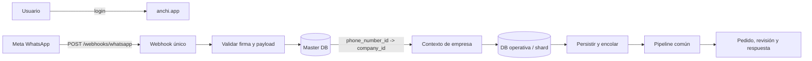
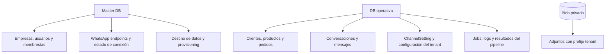
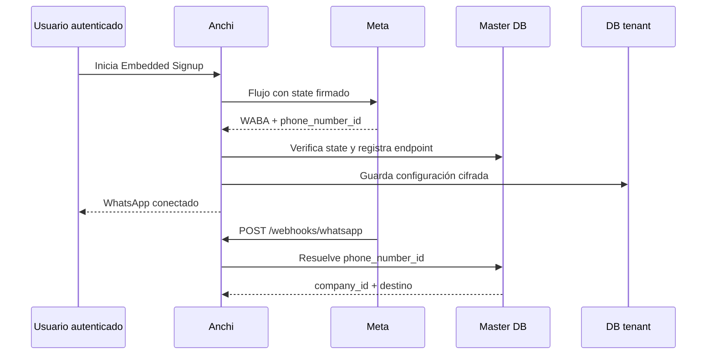

# Arquitectura multiempresa de WhatsApp para Anchi

> **Decisión recomendada** · Un solo Anchi, un solo dominio y un único webhook. Cada evento se asigna a una empresa por sus identificadores de Meta y después se procesa dentro del contexto de esa empresa.

## 1. Cómo debe funcionar

Todas las empresas usarán la misma aplicación:



La URL pública sería siempre:

```text
https://anchi.app/webhooks/whatsapp
```

No se necesita una URL distinta por empresa. Meta envía en el payload el `phone_number_id` y el `waba_id`; esos valores son los que permiten saber a qué cliente pertenece el evento.

## 2. Enrutado seguro del webhook

El orden correcto es:

1. Validar `X-Hub-Signature-256` con el secreto de la aplicación.
2. Leer `phone_number_id` y `waba_id` sin usar todavía ninguna base operativa.
3. Buscar el registro en una tabla indexada de la **Master DB**.
4. Obtener `company_id` y el destino de datos de esa empresa.
5. Abrir el contexto tenant y persistir el evento.
6. Aplicar deduplicación por `company_id + provider + external_id`.
7. Encolar el procesamiento y responder rápido a Meta.

La tabla maestra recomendada sería conceptualmente:

```text
whatsapp_endpoints
  id
  company_id                 FK -> companies.id
  waba_id                    índice
  phone_number_id            UNIQUE
  display_phone_number
  status                     active / pending / disconnected
  onboarding_mode            cloud_api / coexistence
  is_on_biz_app
  tenant_database_id
  created_at / updated_at
```

`phone_number_id` debe ser la clave principal de resolución. `waba_id` sirve como comprobación adicional. Si no hay coincidencia, hay más de una o la pareja no es coherente, el evento se registra como no resuelto y no se procesa.

### Situación actual que conviene corregir

Anchi ya guarda `phone_number_id` y `business_account_id` en `ChannelSetting`, pero el webhook global recorre las bases tenant activas para encontrar una coincidencia. Con cientos de empresas esto será lento, caro y frágil. La tabla `whatsapp_endpoints` evita ese recorrido y permite resolver el tenant con una sola consulta indexada.

Además, el código todavía puede generar URLs con `/{company_slug}`. Para nuevas altas debe establecerse `/webhooks/whatsapp` como endpoint canónico; la ruta por slug puede conservarse temporalmente por compatibilidad.

## 3. Dónde guardar cada cosa



Las credenciales de Meta siguen siendo por empresa, cifradas en la configuración tenant y nunca visibles en el navegador ni en logs. Los identificadores no secretos necesarios para enrutar —especialmente `phone_number_id`— deben estar también en la Master DB.

Para adjuntos no conviene crear un Blob Store por cliente. Es suficiente un almacén privado por entorno, con rutas como:

```text
tenants/{company_id}/whatsapp/{message_id}/{random}-{filename}
```

Cada descarga debe comprobar siempre que el mensaje y el adjunto pertenecen al tenant de la sesión.

## 4. ¿Una base de datos por empresa?

No como regla general.

| Escenario | Recomendación |
|---|---|
| Demo o pocos clientes | Puede mantenerse una DB por empresa: aislamiento sencillo y útil para pruebas. |
| Decenas o cientos de clientes | Una DB Postgres compartida o varios shards regionales, siempre con `company_id`, índices y aislamiento fuerte. |
| Cliente grande, regulado o con mucho volumen | DB dedicada opcional, seleccionada desde `Master DB`. |

La aplicación ya tiene la abstracción `MasterTenantDatabase`, por lo que se puede evolucionar sin rehacer todo: varias empresas pueden apuntar a una misma DB operativa o a un shard, mientras los clientes especiales conservan una DB dedicada.

La opción más equilibrada para Anchi es un modelo híbrido:

```text
Master DB única
   ├── Shard operativo EU-1: clientes normales
   ├── Shard operativo EU-2: crecimiento futuro
   └── DB dedicada: clientes enterprise o requisitos especiales
```

No se debe abrir una conexión nueva por petición. En Vercel las funciones son efímeras: hay que usar URLs pooled de Postgres, pools pequeños y una caché controlada del destino tenant.

## 5. Alta de una empresa con Embedded Signup



El `state` debe vincular de forma firmada al usuario y a la empresa que inició el alta. Así se evita que una conexión de Meta termine asociada accidentalmente a otro cliente.

## 6. Reglas para escalar en Vercel

- El webhook solo valida, resuelve, persiste y encola; no ejecuta el pipeline completo en la petición.
- Los jobs deben ser idempotentes, reintentables y con bloqueo por tenant.
- La cola actual basada en base de datos sirve para comenzar; con más volumen conviene pasar el procesamiento a una cola/worker gestionado fuera de la función web.
- La configuración de cada empresa vive en base de datos, no en variables de entorno globales.
- Los logs deben incluir `correlation_id`, `company_id`, `phone_number_id` enmascarado, tipo de evento, resultado y latencia; nunca token, firma, payload completo ni contenido sensible.
- Las migraciones deben versionarse para la DB compartida y ejecutarse sin bloquear el tráfico.

## 7. Orden de implementación recomendado

1. Crear `whatsapp_endpoints` en la Master DB, con índice único para `phone_number_id`.
2. Registrar o actualizar ese mapping al completar Embedded Signup.
3. Convertir `/webhooks/whatsapp` en el único endpoint nuevo y dejar la ruta por slug como compatibilidad temporal.
4. Cambiar el resolver para consultar Master DB, no recorrer DBs tenant.
5. Añadir pruebas de aislamiento: dos empresas, dos números y payloads cruzados.
6. Namespaciar los adjuntos en Blob y validar el tenant en cada descarga.
7. Medir volumen real y decidir cuándo separar shards o provisionar una DB dedicada.

### Resultado esperado

Un único dominio puede atender a cientos de empresas sin mezclar conversaciones, credenciales ni pedidos. La empresa se identifica por Meta, la sesión de usuario por membresía y los datos operativos por `company_id` y destino tenant.
